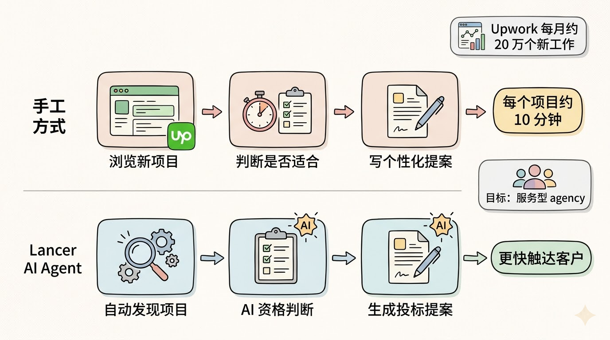
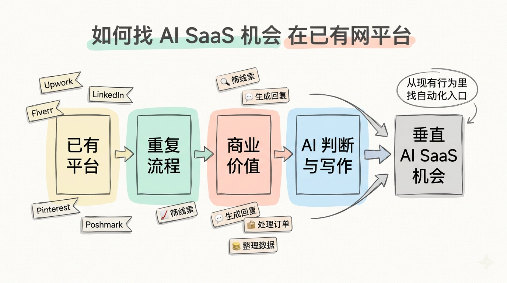
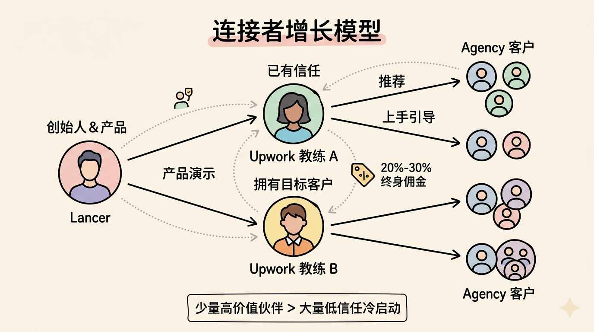
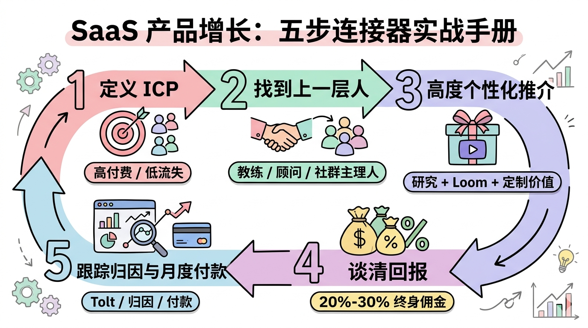

# 我用别人的客户，做出月入 1 万美元的 AI SaaS

我叫 Ivan，来自马其顿。我做了一个叫 Lancer 的 AI AI 智能体，现在每月收入大约 1 万美元。

Lancer 的功能很具体：它帮自由职业者和服务型代理公司把 Upwork 变成一个自动化获客渠道。它会自动发现合适的项目、判断项目质量，并生成投标提案。

我们在上线后的第 3 或第 4 个月，就做到了每月 1 万美元。整个过程没有投放付费广告，也没有先做一个大受众账号。

真正起作用的，是我称为连接者的一套增长策略。

简单说，我没有直接去说服几百个潜在客户，而是找到那些已经被潜在客户信任、并且手里有这些客户的人，让他们帮我卖。

## Lancer 到底解决什么问题

过去 5 年，我一直在经营一家软件开发 agency，叫 NB Masters。我们做到了七位数收入，团队接近 20 个全职员工。

我们的主要获客渠道就是 Upwork。

很多人低估了 Upwork。它看起来只是一个自由职业平台，但其实上面每个月大约有 20 万个新工作发布。对服务公司来说，这是一个很大的潜在客户池。

问题在于，Upwork 上的机会分布在一天 24 小时里。你需要不断浏览新项目，判断它是不是适合你，再写一封个性化提案。每个项目从筛选到写提案，通常要花大约 10 分钟。

这类工作非常重复，而且很适合 AI。

我当时的判断是：一个 AI agent 在这种任务上，可能比人快 10 倍甚至更多。

所以我们一开始不是为了卖给别人，而是先做了一个内部工具。结果它在我们自己的 agency 里效果很好。

后来我邀请了几个同样做 agency 的朋友测试。他们在两周内合计签下了 3 个五位数客户。

那一刻我意识到：这不是一个小脚本，它可能是一个独立产品。

于是 Lancer 诞生了。

## 它怎么收费

Lancer 是典型订阅模式，但定价偏高客单价。

我们现在有三个计划。

第一个是按量付费，79 美元包含 30 封提案，额外每封提案 2 美元。

第二个是 light plan，300 美元包含 250 封提案，额外每封 1.5 美元。

第三个是无限计划，一开始是发布期优惠，每月 500 美元。

这个定价能成立，是因为客户不是买“自动写几句话”，而是在买获客能力。

对一个 agency 来说，如果 Lancer 能帮它多签一个五位数客户，每月几百美元就很容易算得过来。

## AI agent 的机会在“平台上的重复工作”

我认为现在有一个很大的机会：在已有软件平台之上，自动化那些重复、繁琐、但又有商业价值的工作。

Upwork 是一个例子。你也可以想象 Fiverr、LinkedIn、Pinterest、Poshmark，或者任何有大量用户和重复流程的平台。

这些平台已经聚集了用户，也聚集了行为。你不需要从零创造一个市场，而是站在已有平台上，找到某个用户群体每天都在重复做的工作。

AI 的价值在这里会很明显。几年前，如果你想自动判断一个 Upwork 工作是否合适，再写出一封像样的个性化提案，很难。但现在大语言模型（LLM，Large Language Model）可以处理很多上下文和细节，比如识别客户需求、提取关键信息、按要求写入某个“暗号”，再生成更像真人写的回复。

所以，Lancer 不是一个抽象的“AI 概念产品”。它解决的是一个很具体的、每天都在发生的流程问题。

## 我们怎么做出 MVP

最早的内部版本，是我自己用一个周末拼出来的。它远远不是商业化产品，只能说能完成核心动作。

之后我们花了大约 3 个月做 MVP（Minimum Viable Product，最小可行产品）。

技术栈沿用了 agency 里熟悉的东西：前后端都用 TypeScript，前端用 Next.js，后端用 Node.js，托管和数据部分用 GCP 和 Firestore。

Lancer 里大语言模型主要用在两个地方：项目筛选/资格判断和提案写作。

后来的技术栈还包括 OpenRouter，用来调用不同 LLM API；Hetzner 和 GCP 做托管；各种代理服务商用来安全连接 Upwork 账号；Elasticsearch 用来查询工作和数据；Tolt 用来管理联盟推广。

现在我们也大量使用 Cursor 和 Opus 4.5 这类 AI 编程工具，实际手写代码的比例已经低了很多。

## 增长的核心不是广告，而是连接者

很多 SaaS 创业者的第一反应是投广告、冷邮件、发 TikTok 或做内容。

我没有这么做。

我的方法是：先定义 ICP（Ideal Customer Profile，理想客户画像），然后找到 ICP 上面一层的人。

所谓上面一层，就是那些已经拥有你的理想客户网络、并且被他们信任的人。我把这类人叫 connectors。

对 Lancer 来说，理想客户不是所有自由职业者，而是高频投标、经常需要在 Upwork 上获客的 agency 用户。

那么，谁已经和这些人有联系？

答案是 Upwork Upwork 教练。

这些教练每个月可能有 5 个、10 个甚至 20 个付费客户。客户愿意付 600 美元，有时甚至超过 1000 美元，来学习如何在 Upwork 上拿到潜在客户。

他们自己通常也有很强的 Upwork 资料页、很多好评、很多入站咨询。更重要的是，他们在这些客户心中有信任。

如果他们推荐 Lancer，客户更容易相信。

这就是策略的关键：与其我一个个说服每个 agency，不如说服已经拥有 agency 客户的人。

对我来说，卖给一个 connector，就像一次高客单价销售电话。因为一个连接者背后可能带来很多客户。

## 我们最早的增长来自两个 Upwork 教练

Lancer 的大部分早期增长，其实来自两个 Upwork 教练。

第一个教练是通过测试用户介绍来的。这个测试用户以前和那位教练合作过，于是帮我做了引荐。我要做的只是演示产品。对方看到后很惊讶，之后就开始把客户推荐给我们。

第二个教练难一些。我通过 LinkedIn 冷启动联系他，并且非常直接地提出：我愿意付他 1000 美元，只要他和我通一次电话，试用一下产品。

这听起来很激进，但它背后的逻辑很清楚。普通用户每月可能只付几百美元，你很难为每个普通用户花 1000 美元获客。但如果这个人背后有源源不断的目标客户，他就不只是一个用户，而是一个渠道。

佣金方面，我们设计得也很明确。

如果教练完整签下客户、完成引导上手并帮他们设置 Lancer，他可以拿 30% 的终身佣金。

如果只是推荐，佣金是 20%。

这让连接者有动力真正推广，也让他们觉得这不是一次性交易。

## 如果从头再来，我会用这 5 步

第一步，定义 ICP。

你要先知道谁最适合你的产品。不是“所有人”，而是那些上手摩擦低、愿意付费、留存时间长、不容易流失的人。

在 Lancer 这里，我们发现 agency 用户比单个自由职业者更适合，因为他们投标量更高，商业价值更大。

第二步，找到 ICP 上面一层的人。

你要问：谁拥有大量理想客户？谁被他们尊重？谁说一句话，他们会认真听？

Lancer 的答案是 Upwork 教练。别的产品可能是顾问、课程老师、社区主理人、行业 KOL、工具集成商或服务商。

第三步，给连接者写高度个性化推介。

不要群发模板。你是在争取一个潜在渠道，不是随便拉一个用户注册。你可以做大量研究，引用对方的内容，录一段 Loom 视频，解释为什么你的产品对他的客户有价值。

对普通 SaaS 用户，你可能不值得花这么多时间。但对一个优质联盟伙伴，值得。

第四步，谈清楚回报。

常见标准可以是 20% 到 30% 的终身佣金。具体比例取决于对方网络规模、活跃程度、是否有社交影响力、是否已经和竞品合作。

有时你还可以给预付款，比如我给第二个教练的 1000 美元电话费。关键是判断他背后的长期价值。

第五步，做好跟踪和月度付款。

一旦你有多个 affiliate，就必须把归因和付款做清楚。我们用 Tolt 这类联盟营销软件来管理推荐关系和佣金支付。这样每个月谁带来了多少销售、该付多少钱，都不会混乱。

## 为什么这比直接卖给客户更高效

如果我直接冷邮件几百个 agency，我可能要经历大量拒绝、低回复率和低信任。

但 Upwork 教练已经拥有信任。他们的客户本来就在为“如何从 Upwork 拿客户”付钱。Lancer 正好是一个可以提高成功率、节省时间的工具。

所以这不是硬塞一个无关产品，而是把一个工具嵌入他们已有的服务流程里。

对教练来说，它是增值服务和新的收入来源。

对客户来说，它是教练推荐的实用工具。

对我们来说，它是低广告成本的分发渠道。

这就是 connector 策略的本质。

## 我给过去自己的建议

如果能给几年前的自己一句建议，我会说：早点开始做软件产品。

我过去为了收入和财务安全，花了很多时间经营开发 agency。它很赚钱，但天花板也很明显，而且很难让我持续学习那些高杠杆技能。

早在 OpenAI 发布早期 API 的时候，我和联合创始人就讨论过要不要全力做 AI 产品。最后我们选择继续扩大 agency。

现在回头看，这可能不是最优选择。

做软件产品会逼你学习很多高度可迁移的能力：找问题、做产品、定价、分发、留存、自动化、数据分析。这些能力对几乎所有线上业务都有价值，甚至比一两年赚到的钱更重要。

尤其在 AI 这场技术革命里，我们还非常早。未来几十年都会有大量机会。

## 普通人怎么从这个案例里找机会

如果你想做类似 Lancer 的产品，可以从一个问题开始：

哪些平台上，有大量重复、手工、耗时间、但直接关系到赚钱的任务？

Upwork 上是找项目、筛项目、写提案。

其他平台也一定有类似流程：找客户、筛线索、生成回复、发布内容、处理订单、整理数据、跟进机会。

AI 最适合的不是“看起来很酷”的场景，而是那些过去需要人每天重复做、但又包含一些判断和语言处理的工作。

找到这类问题后，不要只想着怎么做产品。也要问：谁已经拥有这些客户？

如果你能找到连接者，你就不需要先花几年建立自己的受众。你可以借助已有信任，把产品送到真正需要它的人面前。

Lancer 能在几个月内做到月入 1 万美元，核心不是广告预算，也不是大流量账号。

核心是一个具体痛点，一个能省时间也能赚钱的 AI agent，以及两个愿意把它推荐给客户的连接者。

这就是我用别人的客户做出 SaaS 的方法。
