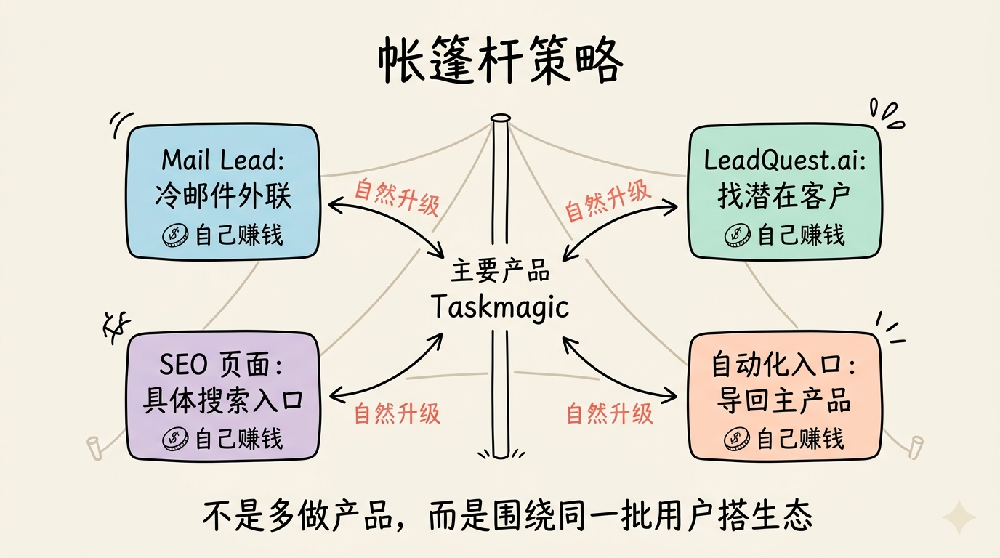
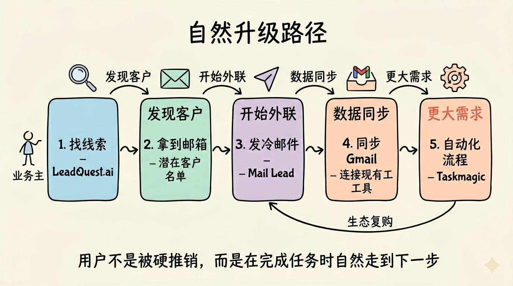
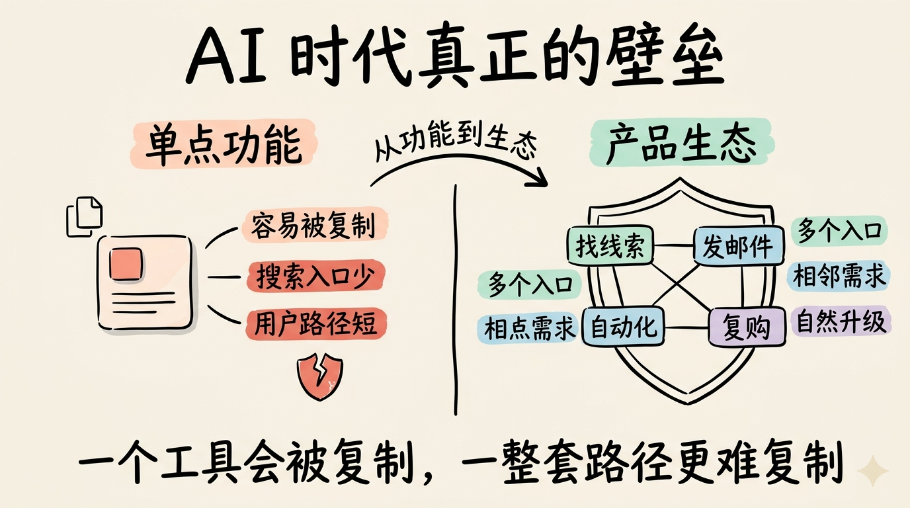
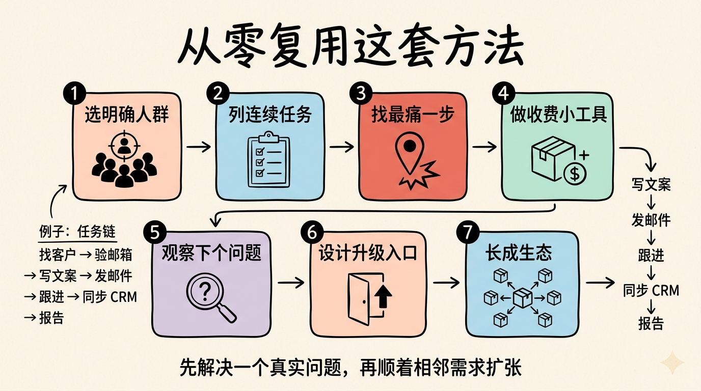

# 一个 SaaS 做到年入 300 万美元后卖掉：我学到的不是“功能”，而是产品生态

很多人最近都在说：AI 编程工具出来以后，SaaS 是不是要死了？

我听到 Jeremy 的故事之后，反而觉得答案没那么简单。

Jeremy 做过一个叫 Taskmagic 的 SaaS（Software as a Service，软件即服务，**用户按月、按年或按使用量付费使用在线软件**）。它不是一个庞大的团队做出来的。公司核心只有他和 CTO 两个人，却把产品做到超过 6 万用户、约 8000 个付费客户，有些月份收入超过 40 万美元，年收入做到大约 300 万美元，还进入了 Inc. 5000 榜单。

后来，他把这家公司卖了。交易金额是七位数中高段，对他和唯一员工来说都是改变人生的钱。

但这篇文章我不想把重点放在豪宅、车、出售公司这些外在结果上。真正值得拆的是他怎么做增长。

他用的策略叫 tentpole strategy，我把它翻译成“帐篷杆策略”。

这个名字听起来有点抽象，但核心很简单：不要只围着一个主产品打广告，而是围绕同一批用户的连续需求，做一组更小、更具体的产品。每个小产品自己能赚钱，也能把用户导回主产品。

这对今天做 AI 产品、工具产品和小型 SaaS 的人，很有参考价值。

## Taskmagic 解决的是什么问题

Jeremy 最早不是技术背景。

他一开始做的是一个无代码应用构建器，后来在 2019 年左右开始赚到钱，于是有能力雇第一个员工。2020 年，他们重建了产品，并把它做到七位数收入。

但到了 2021 年，他们开始重新思考：更大的机会到底在哪里？

当时很多用户都在问同一类问题：我怎么把这些重复动作自动化？

Jeremy 注意到，很多 Zapier 用户虽然想自动化工作流，但会被 API 限制住。

API（Application Programming Interface，应用程序编程接口，**不同软件之间互相调用数据和功能的通道**）很好用，但前提是软件开放了接口。如果一个网站没有合适的 API，或者流程需要模拟真实人在浏览器里点击、复制、提交表单，传统自动化工具就很难处理。

Taskmagic 切入的就是这个场景。

它允许用户自动化浏览器里的“人类行为”：点击按钮、打开网页、填写信息、执行那些原本需要人在浏览器里反复做的动作。

换句话说，它不是只连接 API，而是把浏览器操作也变成可自动化流程。

这个定位让它吸引了业务主、代理公司、自由职业者，以及大量想提高效率、获取客户的人。

## “帐篷杆策略”到底是什么

普通 SaaS 的做法通常是：做一个产品，然后围绕这个产品做营销。

Jeremy 的做法不一样。

他把 Taskmagic 当作主帐篷杆，也就是核心产品。然后在周围搭出一批小产品。

这些小产品不是随便做的“副业”。它们都服务同一套用户生态。

第一步，是找到现有客户的“下一个问题”。

Taskmagic 的用户里有很多业务主、代理公司和自由职业者。他们用自动化工具，是为了省时间、找客户、做销售。那他们的下一个问题是什么？

很自然：他们需要发冷邮件，需要做外联，需要找到更多潜在客户。

于是 Jeremy 做了一个小产品，叫 Mail Lead。

Mail Lead 是一个简单的邮件外联平台。它不是 Taskmagic 的一个复杂功能模块，而是一个独立产品。它有自己的页面、自己的定位、自己的 SEO 机会。

SEO（Search Engine Optimization，搜索引擎优化，**让网页更容易被 Google 等搜索引擎收录并排名靠前的增长方式**）在这里很关键。

Jeremy 的判断是：越具体的产品，越容易在搜索里获得排名。

“自动化软件”太宽了。但如果你做的是面向某类场景的冷邮件外联工具，关键词更具体，用户意图也更明确。这样的小产品更容易被搜索到，也更容易解释清楚。

Mail Lead 后来单独带来了接近七位数收入。

## 小产品必须有自然升级路径

这套策略最重要的一点，不是“多做几个产品”。

如果只是乱做一堆互不相关的工具，那只是分散精力。

Jeremy 真正做对的是：每个小产品都通向主产品。

以 Mail Lead 为例，用户一开始只是想发冷邮件。但当他开始使用后，很快会遇到新的需求：我想把 Mail Lead 和其他软件连接起来，我想把线索同步到 Gmail，我想让更多步骤自动发生。

这时，产品里会出现一个“自动化”入口。

用户点进去，就会来到 Taskmagic。

这就是自然升级路径。

用户不是被硬推销过去的，而是在完成自己原本任务时，刚好碰到了更大的自动化需求。

这比单纯投广告更有效。

因为用户已经在使用生态里的一个工具，已经暴露出相邻需求，转化到主产品就顺理成章。

Jeremy 后来又做了 LeadQuest.ai。

Mail Lead 用户需要发邮件，那他们还需要什么？需要潜在客户名单。

于是 LeadQuest.ai 用 AI 帮用户搜索可以外联的潜在客户。用户在 LeadQuest.ai 里找到邮箱后，想把这些邮箱自动导入 Gmail，就会用到 Taskmagic；如果想批量发送邮件，又会买 Mail Lead。

这样，LeadQuest.ai、Mail Lead 和 Taskmagic 之间形成了互相导流。

这就是“生态”，而不是几个孤立产品。

## 为什么这套方法适合 AI 时代

以前做软件成本高，一个小团队很难同时维护多个产品。

但今天，无代码工具、AI 编程工具和模板化基础设施把开发门槛降低了。小团队可以更快做出一个具体工具，并测试它有没有需求。

Jeremy 的看法是：现在你不一定只能卖“信息型免费工具”，你可以直接卖功能。

过去很多公司为了 SEO，会做免费的计算器、指南、资料库，用内容吸引用户。但今天，如果你有足够快的构建能力，可以做一个真正能完成任务的小产品。

这个小产品本身可以收费，也可以成为主产品的入口。

这对 AI 创业尤其重要。

AI 能让产品开发更快，但也会让通用功能更容易被复制。真正的壁垒不一定是“我做了一个功能”，而是“我围绕同一批用户的问题，搭了一个能互相增强的产品网络”。

一个工具可能被复制。

但一整套用户路径、搜索入口、产品升级路径和生态心智，就没那么容易复制。

## 定价上，他也没有只靠订阅

Taskmagic 早期还有一个重要发现：很多用户不想一直付订阅费。

所以他们用过终身买断（**用户一次性付费后长期使用某个权益，常用于早期获客和现金流启动**）和按使用量计费（**用户用得越多付得越多**）来让业务早期自己滚动起来。

这点也很现实。

SaaS 创业者很容易默认“必须订阅制”。但早期真正重要的不是套用某种商业模式，而是找到能让用户下第一单、能让公司继续运转的收费方式。

如果用户对持续订阅有阻力，一次性付费可能更容易启动；如果用户用量差异很大，按量计费可能更公平。

商业模式不是教条，要服务于增长阶段。

## 出售公司并不轻松

Jeremy 后来决定出售 Taskmagic。

表面看，这是一个漂亮的结果：年收入 300 万美元，进入 Inc. 5000，最终以七位数中高段卖掉。

但过程并不轻松。

他把公司放到 Acquire.com 市场上，也和经纪人聊过，后来有超过 100 个人联系他。

在出售过程中，他还买出了投资人股份。这让公司和个人账户都变得很紧张。他说自己一度在美国运通白金卡上刷了 5 万美元，又背上了 20 万美元个人债务，只是为了撑过那段时间。

从外面看，别人可能会说他“卖得太快”。但真实情况是，他当时背靠墙，没有太多退路。

这段经历提醒我：创业故事里的“成功出售”，中间也可能充满现金流压力、家庭压力和心理压力。

线上内容常常过度积极。大家都在说自己增长、融资、赚钱、感谢一切。但真正的经营过程，常常比截图里难得多。

Jeremy 最后给的建议也很直接：不要只分享顺利的一面。坏日子、失败的视频、产品的问题，也应该被看见。因为大多数人真正需要的，不是神话，而是真实的判断。

## 我会带走的几条经验

第一，不要只做一个“大而全”的主产品。

如果你已经知道用户是谁，就可以围绕他们的连续需求做小产品。小产品越具体，越容易解释、越容易搜索排名，也越容易验证。

第二，小产品必须服务同一生态。

Mail Lead、LeadQuest.ai 和 Taskmagic 的关系很清楚：找线索、发邮件、做自动化。它们不是三个方向，而是一条用户任务链。

第三，升级路径要自然。

用户不是因为你反复弹窗才升级，而是因为他完成当前任务时，真的需要下一步能力。产品设计要让这一步发生得顺。

第四，AI 时代的软件增长会更像内容增长。

过去我们说“写内容做 SEO”。现在也可以“做小产品做 SEO”。每个小产品都是一个入口，也是一个能收费的功能节点。

第五，分发和产品不能分开想。

Jeremy 做 Mail Lead 时，已经在想 SEO 的具体性；做 LeadQuest.ai 时，已经在想它如何导回 Taskmagic。这不是上线后的补丁，而是产品设计的一部分。

## 如果我从零复用这套方法

我不会照抄 Taskmagic。

更好的做法是先选一个明确人群，比如独立开发者、代理公司、跨境卖家、招聘团队、本地服务商，或者内容创作者。

然后列出他们完成一个核心目标时的连续任务。

比如一个代理公司要获取客户，可能要经历：找潜在客户、验证邮箱、写外联文案、发送邮件、跟进回复、同步 CRM、生成报告。

这里面每一步，都可能是一个足够小的产品。

但主线必须清楚。

你可以先做其中最痛的一步，把它做成一个能收费的小工具。然后观察用户的下一个问题是什么，再做相邻工具。最终让这些工具互相导流，形成一个生态，而不是互相消耗注意力。

这就是我从 Jeremy 身上学到的核心。

SaaS 不是死了。

只是“做一个产品，然后等用户来”的时代更难了。

AI 让构建更快，也让竞争更快。真正有价值的，是围绕一个具体人群，持续解决他们一连串真实问题，并把每个产品都变成下一个产品的入口。

这比单点功能更难，也更值得做。
