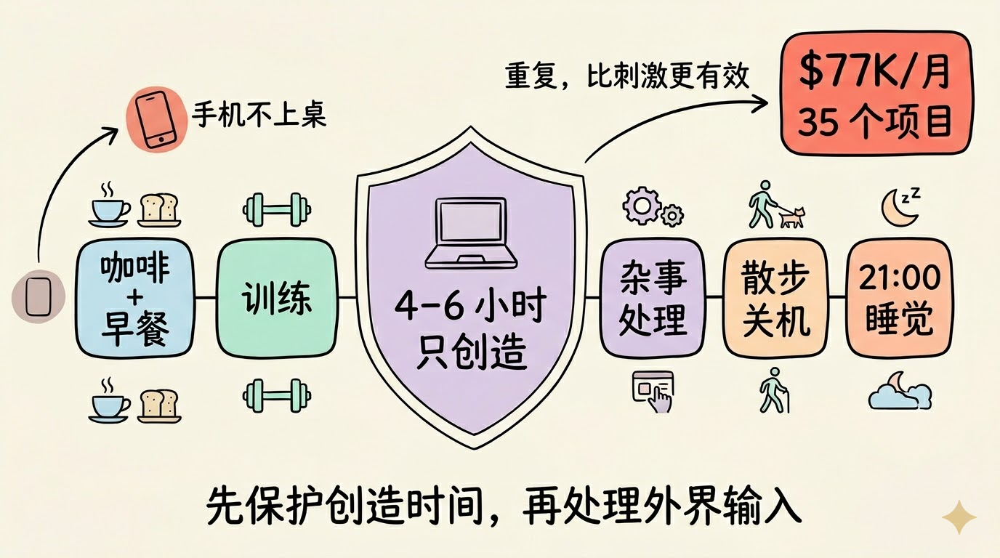
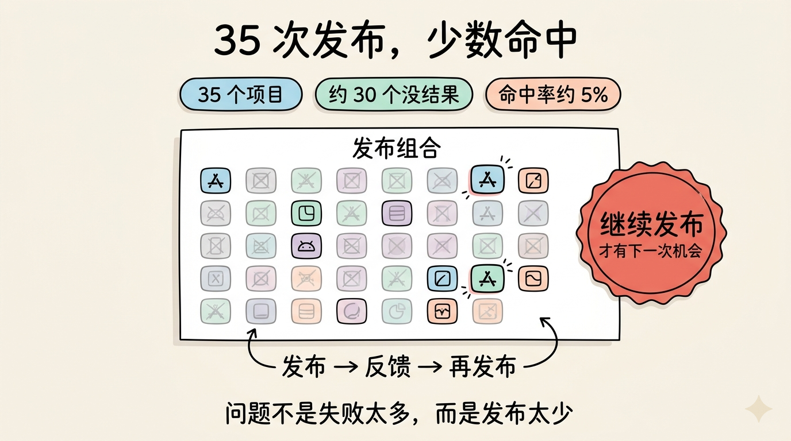
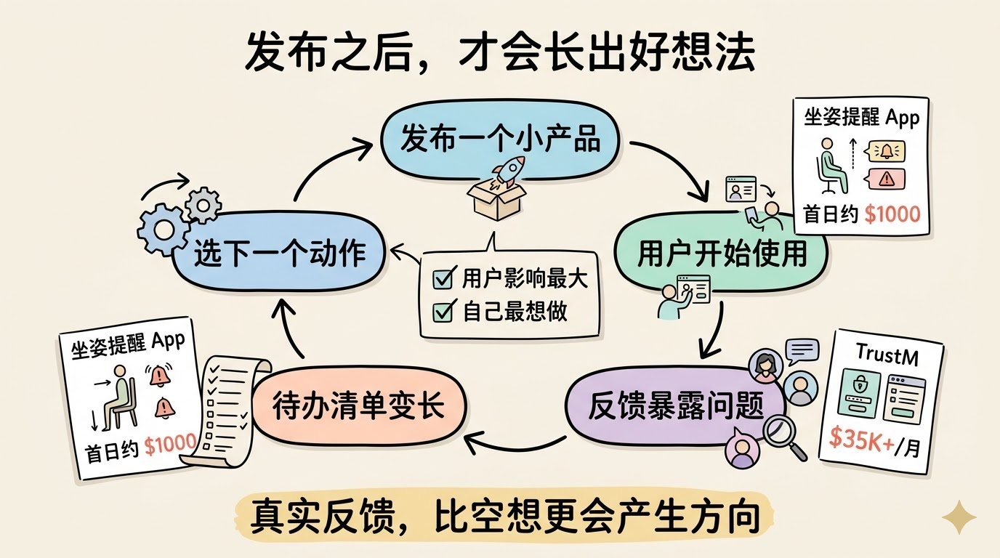
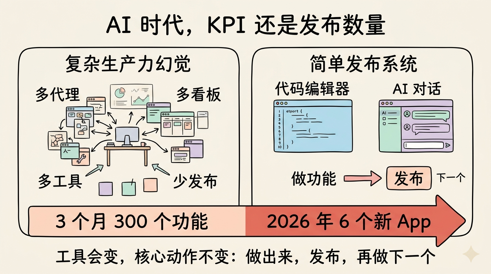

# 2026-04-26-我每月做到 7.7 万美元收入后，真正依赖的是这套无聊工作法

很多人问我：一个人做公司，怎么能做到每月 7.7 万美元收入，还能连续做出 35 个产品？

我的答案可能有点反直觉。

不是每天追新工具，不是开一堆 AI 代理，也不是把日程排得像创业节目一样刺激。

我真正依赖的，是一套非常重复、甚至有点无聊的生活方式：每天差不多同一时间起床，先吃早餐和喝咖啡，然后训练，接着把手机关掉，连续 4 到 6 小时只做一件事：创造东西。

我一年到头几乎都这样工作。不是因为我被迫这么做，而是因为我真的喜欢。我不太喜欢星期天，因为我最开心的事情其实就是做东西。度假时我反而会难受，因为节奏被打断了。

这听起来可能很极端，但它背后的逻辑很简单：如果你想靠自己做产品活下来，最重要的指标不是“今天看了多少趋势”，而是你到底发布了多少东西。

## 我的一天，从不碰手机开始

我的一天通常从咖啡和早餐开始，和妻子一起吃完后，我们会去健身房。

最近我们在练 Hyrox（**一种结合跑步和功能性训练的体能赛事**），所以训练里会有推雪橇、深蹲、跑步这些项目。

训练结束回家，我才正式进入工作状态。

这时最重要的一件事是：不上网。

我不看手机，不查邮件，不刷社交媒体，也不处理客服消息。早上的第一段时间，我要让自己完全离线。

原因很现实。

现在 AI 领域每天都有新东西冒出来。如果我一早打开社交媒体，很容易产生一种错觉：别人都比我快，我是不是落后了？我是不是应该多做一点？结果一个小时过去了，我什么也没创造，只是消耗了注意力，还把自己的节奏弄乱。

所以我会保护早上的 4 到 6 个小时。

这段时间只用来深度工作。我打开代码编辑器，开始写功能、做产品、修真正重要的问题。邮件、客服、社交媒体都放到后面。

如果我一早看到一封用户邮件，说某个 App 出 bug 了，我当然会想马上修。但那样一来，我本来要做的新东西就被打断了。久而久之，你每天都在响应别人，却没有推进自己的核心产出。

对我来说，手机就是早上最大的敌人。

## 35 个项目里，大多数都失败了

我到现在大概发布过 35 个创业项目。

但这里面大概 30 个都没什么结果。没用户，没收入，或者只有很少的收入。

换句话说，我的命中率大概只有 5%。

这也是我不断强调“继续发布”的原因。

如果你只掷一次骰子，然后把所有希望都压在这一次上，大概率不会发生什么惊人的事情。但如果你一直掷，一直发布，一直把新想法放到真实市场里，总会有某一次开始奏效。

一旦某个产品有了用户，有了收入，你就能离开工作岗位，把更多时间投入到下一次尝试里。然后你掷骰子的次数会变多，反馈会变快，成功的概率也会被放大。

很多人有很好的想法，但想法只存在脑子里，或者存在电脑里的某个文件夹里。他们迟迟不发布。

我见过太多人说：“我有一个很棒的点子。”

但我几乎没见过有人跟我说：“我试了 10 次，每次都失败了。”

这说明大多数人的问题不是失败太多，而是发布太少。

## 我不再先问“结果会怎样”

过去我也会想：这个产品能赚多少钱？会不会火？别人会不会喜欢？

现在我尽量少想这些。

我更常问自己：我希望世界上存在什么东西？

最近我做了一个很小的 macOS 应用。它会通过摄像头分析我的坐姿，如果我像虾一样弯着背坐在电脑前，它就提醒我坐直。

我做它不是因为我先算出一个巨大市场，而是因为我每天坐在电脑前太久，知道弯腰坐着很糟糕。我觉得这样的工具应该存在。

这对我来说还是一种新类型的产品，因为它是桌面 App，我之前并不熟悉。但我照样把它做出来。

发布当天，我会先检查授权系统能不能工作，用户付款后能不能收到邮件。下午三点左右，我发了一条推文让它上线，也同步发到 LinkedIn、Threads 和 Reddit。

当天就有了第一批客户。周四那天收入大概做到了 1000 美元。

更让我开心的是，我开始看到用户在 Twitter 上晒这个 App，看到它真的出现在用户手里。

这就是我最喜欢的瞬间：我做的东西不再只是我电脑里的文件，而是变成了别人生活里正在使用的工具。

## 好想法往往来自已经发布的东西

我现在有一个很长的待办清单。

里面有已经运行的 App，也有这些 App 需要补的重要功能，还有一些全新的产品想法。

一开始，你可能觉得自己没那么多问题可解决。但只要你开始发布，用户就会给你反馈。你会发现新问题，新问题又会带来新想法。

现在我的待办清单长到一种程度：就算我再活 200 年，也不可能全部做完。

每天结束时，我清单上的东西通常比当天开始时还多。

所以我不会假装自己能用一套完美公式排序所有想法。我通常会凭直觉判断：哪一个功能对用户影响最大？哪一件事会让我最开心？然后就做下一个。

这个过程看起来不系统，但它建立在一个前提上：我一直在发布，所以我一直有真实反馈。

## 第一次发布的恐惧，必须靠发布解决

很多人不敢把自己的作品拿出来。

他们会觉得：太早了，不够好，还不完整，别人会不会笑我？

我很理解这种感觉。它就像第一次去健身房。你在 Instagram 上看到别人举很重的重量，而你第一次走进去，连机器怎么用都不知道。

但只要你真的进去做了一次，恐惧就会消掉大半。

发布也是一样。

第一次发布会杀掉 80% 的恐惧，剩下的 20% 会被一次又一次迭代慢慢磨掉。你会发现，世界没有因为你发布了一个不完美的东西而崩塌。相反，你终于开始得到反馈。

验证一个想法的唯一方式，就是把它发布出去，并且放上购买按钮。

如果没有购买按钮，你验证的只是别人愿不愿意夸你；有了购买按钮，你才知道他们愿不愿意为这个问题付钱。

## AI 时代，最重要的指标没有变

我对 AI 有一个稍微有点争议的看法。

现在很多人痴迷于“生产力”。他们开很多后台代理，让一堆工具同时跑，好像这样就更接近成功。

但我认为，AI 时代真正重要的 KPI（Key Performance Indicator，关键绩效指标，**用来判断你是否真的在前进的核心数字**）没有变。

它仍然是：你发布了多少东西。

我的工作流其实非常无聊。

我坐在同一个代码编辑器里，右边开一个聊天窗口。我和 AI 对话，让它帮我做一个新功能。功能做完，我发布，然后继续下一个。

就这样，我在过去三个月给自己的 marketplace（**连接买卖双方的平台型产品**）发布了大约 300 个功能。2026 年到现在，我也用这种方式发布了 6 个新 App。

很多人以为必须有复杂系统才能开始。但事实上，用早期版本的 ChatGPT 加一个普通代码编辑器，你已经可以做很多事情。

工具会变，核心动作不变：做出来，发布，学习，再做下一个。

## 下午处理杂事，晚上彻底关机

到下午四点左右，我才会上网。

这时候我会看 Twitter、查邮件、处理那些没那么有创造性的工作。比如客服、消息、一些运营类事情。

五点半左右吃晚饭。我和妻子经常会边吃边看剧，所以晚饭会吃得比较久。

然后我们会出去散步。

散步之后，我会非常彻底地关机。手机关掉，电脑关掉，不谈工作。有时看电影，有时读书。

我们每天晚上九点左右上床。

睡前还有一个 30 分钟到 1 小时的放松流程，比如把家里的灯光调暗。这样到床上很快就能睡着。

我不设闹钟，通常早上 6 点到 7 点自然醒。

我以前非常容易困。学生时代一直到二十多岁，只要坐在电脑前专注做事，就会想睡觉。后来我才意识到，睡眠质量对我的情绪稳定和专注力影响巨大。

睡得好以后，我可以连续 4 个小时盯着同一个任务做下去。

睡眠这件事被严重低估了。

## 不要把一个小项目养成“情感宠物”

我经常看到一种错误。

有人有一个很棒的想法，花 6 个月做出来。发布后有几个用户，也许赚了一点钱。于是这个项目变成了他的“宝贝”。

他开始对它产生很强的情感依赖，继续投入大量时间，哪怕这个项目可能要三年后才真正起飞，才足够让他辞职。

我的建议是：不要太早把自己绑死。

继续掷骰子。

继续发布新的想法。

因为下一个产品可能比前一个快 100 倍起飞。每发布一次，你都会学到更多；每分享一次，都会有更多人发现你的作品。

长期看，真正有效的不是死守一个想法，而是持续玩“发布东西”这个游戏。

所以，如果你现在也在做产品，最重要的不是把想法想得更完美。

是发布。

继续发布。

不要放弃。
