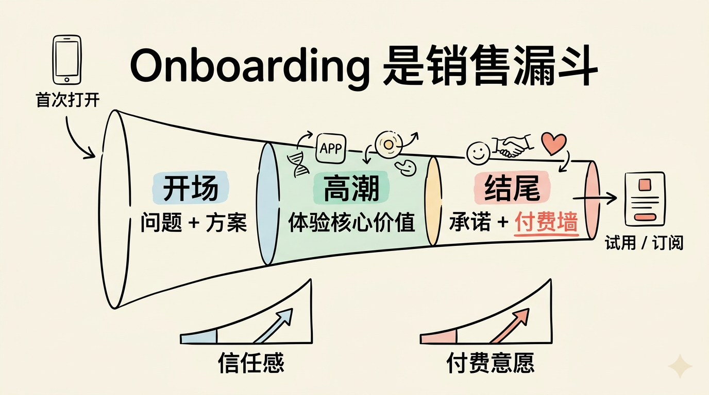
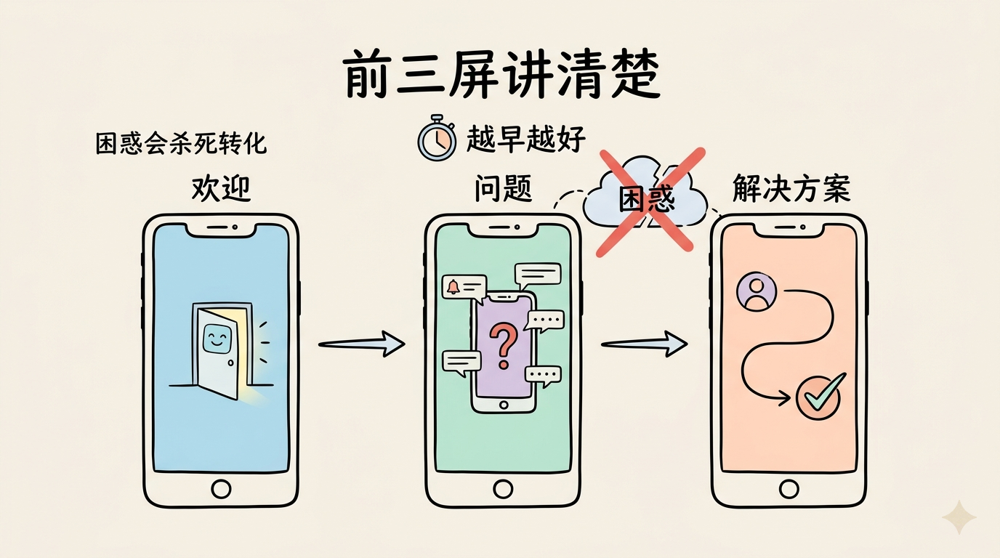
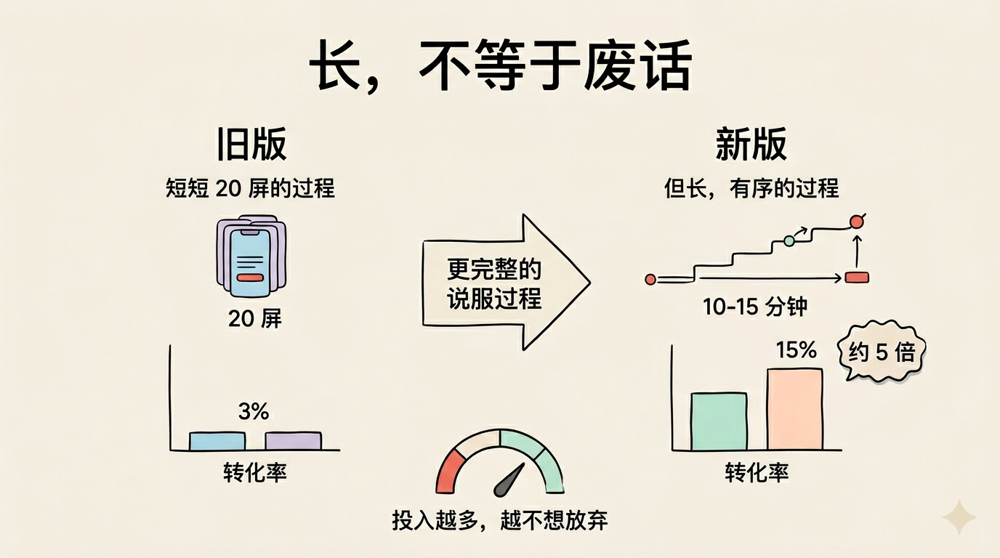
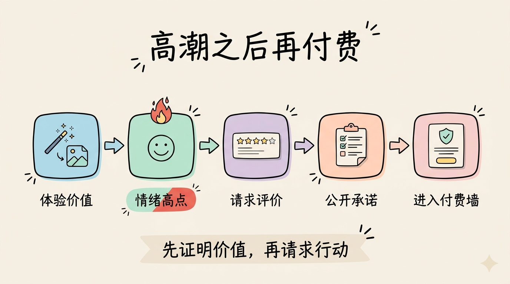

# 2026-04-18-一个月入 4 万美元 App 的 onboarding，真正卖的不是功能

如果你正在做移动 App，有一件事会直接决定收入。

不是你的点子，不是设计，也不是营销。

而是 onboarding。

Onboarding 通常翻译成“新用户引导”。但在移动 App 里，它远不只是教用户点哪里。更准确地说，它是用户第一次打开 App 到看到付费墙之前的完整体验。

Mau Baron 做了一个每月收入超过 4 万美元的移动 App。他没有设计背景，也没有 UX 背景，大学学的是金融，只是后来自己学习 AI，并连续做了几个移动 App。

真正让他的 App 起飞的，是他开始痴迷研究 onboarding：每一屏为什么存在，用户看到它时会怎么想，它如何一步步把用户带到付费。

他有一句话很关键：

一个 App 本质上就是一个 sales funnel，也就是销售漏斗。（**用户从下载安装到理解价值、建立信任、产生付费意愿，是一个逐步筛选和转化的过程。**）

用户第一次打开你的 App 时，对你几乎没有上下文。他不知道你能不能解决他的问题，也不知道你是否值得信任。所以在付费墙出现之前，每一屏都在做同一件事：建立“我为什么应该付钱”的理由。

## 好的 onboarding 像一个故事

Mau 把 onboarding 看成一个故事。

一个故事有 introduction、climax 和 conclusion，也就是开场、高潮和结尾。

每一屏都必须有目的。很多屏幕甚至不是为了介绍产品功能，而是为了让用户感觉被理解，让用户重新审视自己的问题，并让用户自己说服自己：我确实需要这个 App。

他的 App 叫 Prayer Lock，核心场景和信仰、手机使用习惯有关。它的 onboarding 不只是告诉用户“我能帮你祷告”，而是先让用户意识到：你的手机是不是比上帝获得了更多注意力？

这个问题一出来，产品就不是一个普通工具，而是把用户带进了一个具体冲突里。

## 第一部分：开场要在前三屏讲清问题和解决方案

开场的第一条原则，是在前三屏里框定问题和解决方案。

越早越好。

因为困惑会杀死转化。

用户必须很快知道：这个 App 到底在解决什么问题，我会从里面得到什么？

Prayer Lock 的做法很直接。

第一屏欢迎你。

第二屏提出问题：你有没有觉得，手机比上帝得到了更多注意力？

第三屏给出解决方案：Prayer Lock 帮你把上帝放在第一位。

这三屏完成了一个非常重要的闭环：问题是什么，用户为什么在意，产品怎么帮你。

很多新手 onboarding 一上来就堆功能，比如“支持 AI 生成”“支持提醒”“支持数据统计”。但用户还没被说服问题重要时，功能列表没有意义。

先让用户知道自己为什么需要你。

## 第二条：一分钟内给用户一个“啊哈时刻”

开场的第二条原则，是尽快给用户一个 aha moment，也就是“啊，原来如此”的时刻。

这个时刻最好很个人化，像一面镜子。

Prayer Lock 的做法有点激进。它先问用户名字，然后问年龄，再问用户每天花多久在手机上。

拿到这些回答后，它会在下一屏告诉用户：按这个使用习惯算，你一生平均会花大约 16 年在手机上。

这个数字会让很多人停一下。

它不是普通的功能介绍，而是把用户的日常行为换算成一个更震撼的长期结果。

然后产品马上接住这个情绪：别担心，我们可以帮你。你每天愿意给上帝 5 分钟吗？我们来为你制定计划。

这就是好 onboarding 的节奏：不是吓唬用户，而是先让用户意识到问题，再把产品变成解决方案。

## 第三条：提问不是为了收集数据，而是为了让用户自我说服

很多人以为 onboarding 里的问题，是为了让开发者了解用户。

Mau 说，这不是重点。

真正的目的，是让用户自己承认：我确实有这个问题，我确实想改变。

所以问题的设计要非常贴近用户已经存在的痛点。

比如 Prayer Lock 会问：你希望通过 Prayer Lock 实现什么？你想把上帝放在手机之前吗？你想建立稳定祷告习惯吗？

这些问题不是随便问。每个选项都在帮助用户把模糊的不满说出来。

一旦用户自己点了“我想改变”，后面的付费墙就不是突然出现的销售动作，而是前面一连串自我承诺的自然延续。

## 第四条：把用户的答案反射回去

如果用户在 onboarding 里告诉你：“我有社交媒体成瘾问题。”

下一屏就应该说：“我们看到你正在被社交媒体分散注意力。”

这听起来很简单，甚至有点重复，但效果很强。

Mau 在 Prayer Lock 里会把用户刚才选择的目标，原样整理回显给用户。例如用户选择了“把上帝放在手机前面”“建立稳定祷告习惯”，下一屏就会用这些答案生成一个个性化总结。

这样用户会感觉：这个 App 不是在给所有人展示同一套模板，而是在回应我刚刚说的话。

被理解感会提高信任，也会让后面的付费请求更合理。

## 更长的 onboarding，反而可能转化更高

很多人担心 onboarding 太长，用户会跑掉。

Mau 的数据刚好相反。

Prayer Lock 旧版 onboarding 大约只有 20 屏，带免费试用的转化率大约是 3%。

后来他们把 onboarding 改成更完整的流程，根据用户不同，大概要 10 到 15 分钟。转化率从 3% 提高到 15%，大约提升了 5 倍。

背后有一个心理机制叫 loss aversion，损失厌恶。（**人通常会更害怕失去已经投入的东西，而不是单纯追求获得新东西。**）

当用户已经花了 10 分钟回答问题、看总结、体验功能，到达付费墙时，他心里会想：我都投入这么久了，不如先试一下。

当然，长不等于废话。长的前提是每一屏都在推动用户更理解问题、更相信方案、更接近行动。

## 第二部分：高潮要让用户真正体验核心功能

Onboarding 的第二部分是 climax，也就是高潮。

这部分要让用户觉得有趣、兴奋，并第一次真正碰到产品的核心价值。

Mau 的第一条原则是：让用户在 onboarding 中就试用主功能。

在 Prayer Lock 里，产品会问用户两个问题，然后为用户生成一段祷告内容。

这一步非常重要。用户不是只看你说“我们能帮你”，而是真的在付费前感受到：原来它会这样帮我。

很多产品把最有价值的东西藏到付费墙后面，但如果用户完全没体验到价值，就很难付费。

## 在情绪最高点请求评价

高潮部分的第二条原则，是在合适的时机请求 App Store 评价。

Prayer Lock 会先展示用户祷告旅程的第一天连续记录，用一点 gamification，也就是游戏化元素，比如 streak（连续打卡记录）和火焰动画。

当用户感觉“我已经开始了”时，再弹出评价请求。

这个时机很关键。

太早，用户还没熟悉产品，不愿意评价。

太晚，情绪高点已经过去。

很多用户永远不会付费，尤其是硬付费墙 App。对这些用户来说，评价就是他们能给你的第二好回报。

Mau 的 App 有成千上万条评价，页面上能看到大约 1.3 万条评价。评价有两个作用。

第一是 social proof，社会证明。（**当潜在用户看到很多人已经使用并评价某个产品时，会更容易相信它值得下载。**）

第二是 ASO，也就是 App Store Optimization，应用商店优化。（**让 App 在应用商店关键词搜索中排名更靠前，从而获得更多自然下载。**）

至少，你应该确保自己的 App 在品牌关键词下排第一。比如 Prayer Lock 就要确保搜索 Prayer Lock 时自己排在第一位。

## 第三部分：结尾要把用户带到付费墙

Onboarding 的最后一部分是 conclusion，也就是结尾。

这里不是简单说一句“开始使用吧”，而是把前面的情绪、目标和承诺收束起来。

Mau 的第一条原则，是展示用户旅程总结。

告诉用户他现在在哪里，想去哪里，以及你的 App 如何帮他到达那里。

这和前面“反射用户答案”听起来有点重复，但重复本身是有价值的。尤其是年轻用户注意力很短，你必须不断提醒他：你刚才说过你想改变，而我们正在帮你实现。

Prayer Lock 会告诉用户：你将在 30 天内建立祷告习惯。

Mau 建议，尽量把你的 App 和一个可感知的习惯目标连接起来，比如多少天内实现某种改变。

## 可以提前告诉用户：这是付费产品

Mau 的第二条原则有点争议：如果你有免费试用，可以提前告诉用户这个 App 是付费的。

如果没有免费试用，他不建议这么做，因为可能会流失很多人。

但如果有免费试用，提前说明反而能降低后面付费墙的突兀感。

Prayer Lock 会把 App 的成本和现实生活里用户已经愿意花的钱做对比。比如一个月一杯咖啡的价格，换来精神上的平静。

这个对比的目的，不是玩文字游戏，而是重新锚定用户心里的价格感知。

当用户把 App 和“每月一杯咖啡”相比时，它会显得更值得。

## 让用户公开表达承诺

结尾的第三条原则，是让用户说出自己有多想实现这个未来。

Prayer Lock 会直接问：你有多大决心让这个未来发生？

他们发现，大约 95% 的用户会选择“非常坚定”或“极其坚定”。如果用户选择别的答案，产品会准备不同文案继续回应。

这一步的本质，是让用户在进入付费墙前完成一次心理承诺。

最后，再放一个社会证明页面，然后进入付费墙。

Mau 反而提醒大家，不要一开始就过度纠结付费墙本身。早期付费墙没有 onboarding 重要。

付费墙上最值得加的一件事，是在免费试用结束前一天给用户提醒通知。这能减少用户对订阅扣费的担忧，也能建立信任。

## 这套方法不是只适合 Prayer Lock

有人可能会问：这套长 onboarding 只适合宗教类 App 吗？

Mau 的回答是否定的。

他并不是第一个这么做的人。他从很多优秀 App 里获得灵感，比如 Twitter、Cal AI 等。很多高增长移动 App 都有非常长的 onboarding，也都使用类似原则。

他提到，Cal AI 后来以可能达到多位数九位数美元的价格被收购，而它也有移动 App 领域非常长的 onboarding。

所以重点不是照抄 Prayer Lock 的文案，而是理解原则：

先框定问题。

再让用户意识到问题和自己有关。

用问题帮助用户自我说服。

把答案反射回去，让用户感到被理解。

在高潮处让用户体验核心价值。

在情绪高点请求评价。

在结尾总结旅程、锚定价格、建立承诺。

## 做 App 时，先痴迷两件事

Mau 最后的建议很直接。

在你继续加一堆无用功能之前，先痴迷两件事：

第一，营销。

第二，onboarding。

一直优化到你的 download-to-trial rate，也就是从下载到开启试用的转化率，至少达到 10%。

在这之前，很多功能都没有你想象中重要。

因为移动 App 的商业模式里，用户第一次打开产品的那几分钟，往往决定了后面收入的天花板。

如果 onboarding 没有把用户带到“我需要这个”的状态，再好的功能也可能没人愿意付费体验。

真正优秀的 onboarding，不是在教用户怎么用产品。

它是在帮助用户看清自己的问题，感受到你的解决方案，并在付费墙出现前，已经说服自己值得试一试。
